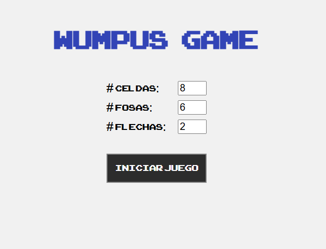
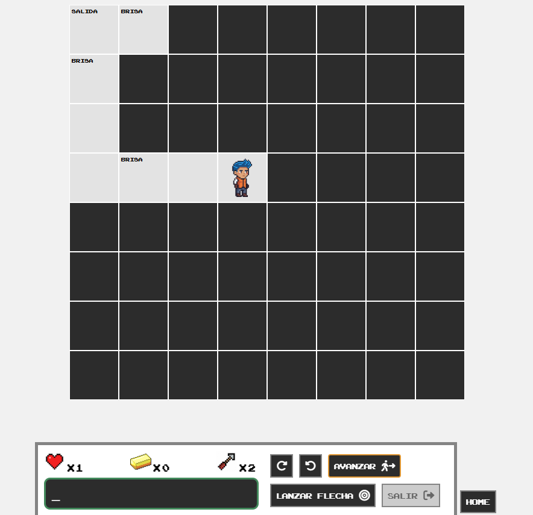
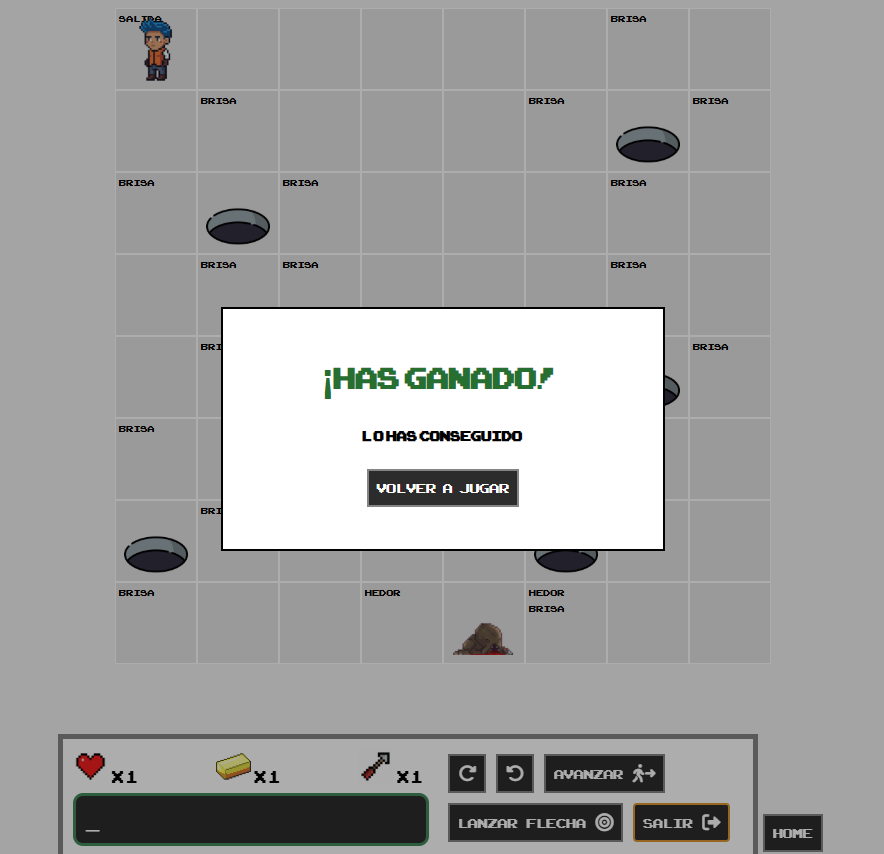
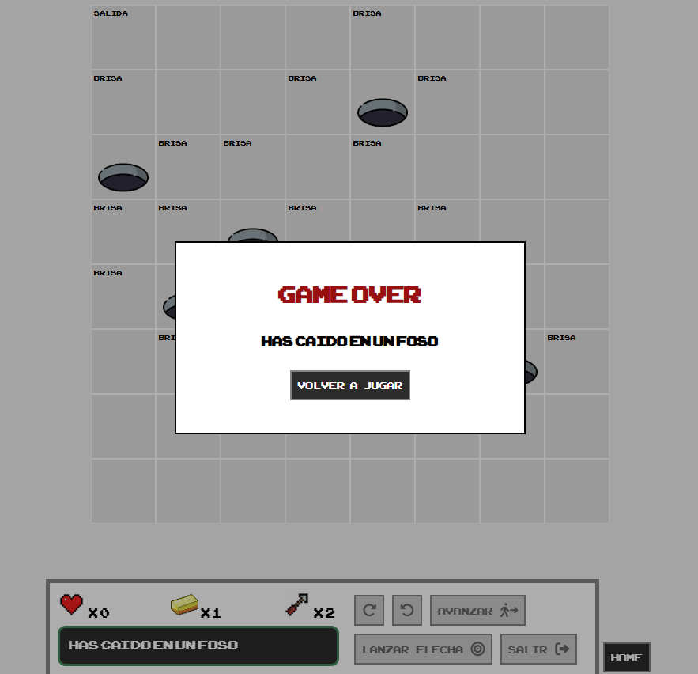

# Hunt the Wumpus

A browser-based implementation of the classic **Hunt the Wumpus** game, built with Angular.

The player enters a dangerous cave system as a hunter. Their mission is to find the hidden gold and return safely to the entrance. However, the cave contains deadly pits and the Wumpus, a creature that kills the hunter if they enter its cave while it is alive.

The cave is initially covered by darkness, so the player must explore it carefully. Nearby hazards provide clues: a **breeze** indicates that a pit is in an adjacent cave, while a **stench** suggests that the Wumpus is nearby. The player can turn, move forward, and shoot arrows in their current direction to kill the Wumpus.

To win, the hunter must collect the gold and return to the starting cave. The game ends if the hunter falls into a pit or encounters the living Wumpus.

## Screenshots

<p align="center">
  
  
</p>

<p align="center">
  
  
</p>

## Features

- Configurable game setup:
  - Cave map size from 4×4 to 50×50.
  - Number of pits from 2 to 30.
  - Number of arrows from 0 to 5.
- Random generation of the cave map, Wumpus, pits, and gold.
- Exploration system with fog of war: caves are revealed as the player visits them.
- Direction-based player movement: turn left, turn right, and move forward.
- Boundary detection and feedback when the hunter hits a wall.
- Environmental clues:
  - **Breeze** in caves adjacent to pits.
  - **Stench** in caves adjacent to the Wumpus.
- Arrow mechanic: arrows travel in the hunter's current direction until they hit the Wumpus or leave the map.
- Automatic gold collection when the hunter enters the gold cave.
- Game-over states for falling into a pit or meeting the Wumpus.
- Win condition requiring the player to collect the gold and return to the starting position.
- Status panel showing remaining arrows, collected gold, life status, and game notifications.
- Complete map reveal when the game ends.
- Route protection that prevents access to the game screen before a game has been initialized.

## Architecture

The application follows a modular Angular structure with a clear separation of responsibilities:

- `HomeComponent` configures and starts a new game through a reactive form.
- `GameComponent` renders the map, controls, status panel, and end-game modal.
- `CaveComponent` represents an individual cave and handles its interactions.
- `MapService` creates the map and places hazards, gold, and environmental clues.
- `HunterService` manages the hunter's state, movement, arrows, inventory, and win/loss conditions.
- `NotificationsService` shares real-time game messages using RxJS observables.
- `InitGameGuard` prevents direct navigation to the game route before initialization.
- Custom pipes select the appropriate sprites for the hunter and Wumpus.

## Tech Stack

- Angular 14
- TypeScript
- RxJS
- Angular Reactive Forms
- Font Awesome
- Jasmine and Karma for unit testing

## Run Locally

This project uses Node.js 16.x.

```bash
npm install
npm start
